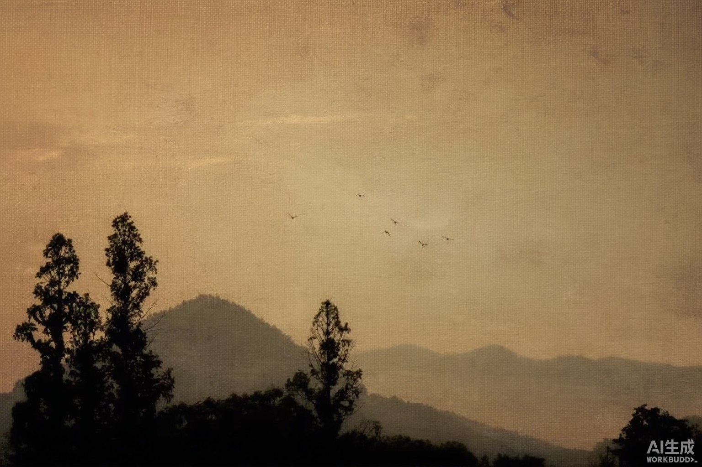

# 暗幕影像 · Dark Canvas

给图片生成 agent 的 skill，复现一种安静的自然油画语言：**暖金亚麻画布、可见经纬织纹、晕开色团、羽化边缘、层次退远的山、近黑剪影、一个小而亮的锚点**。



上图是按默认配方实测生成的样本（3:2，1536×1024），非摄影师作品。已知工具缺陷：`image_gen` 会在右下角压上「AI生成」水印，提示词无法关闭。

这是基于参考图可见特征编写的原创工作流，不是摄影师官方工具，不承诺像素一致。

## 校准结论

对二十四张参考逐张复核后确认：主调是**暖金／赭石／麦色**（约十五张），中性灰只占少数；质感是**亚麻布面油画**，织纹在缩略图级别即可见；鸟／飞鸟是高频母题。这三点与本skill 上一版（默认中性灰、要求"不是油画"）相反，已修正。

## 使用

将 `skills/dark-canvas` 文件夹复制到你的 agent 的技能目录，或从 [Releases](https://github.com/yunmin311/dark-canvas-image-skill/releases) 下载技能 ZIP 并解压其中的 `dark-canvas` 文件夹。Codex 的本机用户目录通常是 `~/.codex/skills/`；在 WSL 中是该Linux 用户的目录。支持 SKILL.md 的其他 agent 按其安装方式使用。图像生成工具由宿主环境提供，仓库不包含 API 密钥或模型服务。

示例请求：

```text
用 $dark-canvas 生成一张暖金亚麻油画：金色天空、低山脊层层退远、近黑树影、天空一小群飞鸟，织纹要看得见。
```

```text
用 $dark-canvas 把这张照片重画成暖金亚麻油画质感，保持建筑、栈桥和小船的位置与原裁切。
```

查看 [skill 入口](skills/dark-canvas/SKILL.md)、[视觉配方](skills/dark-canvas/references/visual-recipe.md)、[提示词模板](skills/dark-canvas/references/prompts.md) 和 [实测记录](examples/validation.md)。下载后可直接用浏览器打开 `preview.html` 看并排对照。技能文件夹可独立使用。

## 来源与图片

风格分析以用户提供的二十四张参考图与两张已认可的 Creative OS AI 生成案例为基础。用户的摄影参考只保存在本地被忽略的目录，**不包含在公开仓库中**。摄影师身份的检索证据与限制见 [来源记录](SOURCES.md)。

文字与 skill 配置采用 MIT 许可证；仓库内 AI 生成示例的来源单独列于 [图片说明](ASSETS.md)，不把第三方摄影作品纳入许可证。
