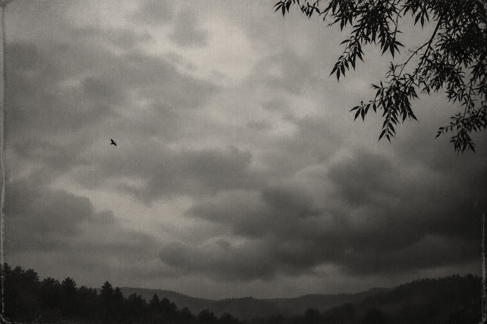
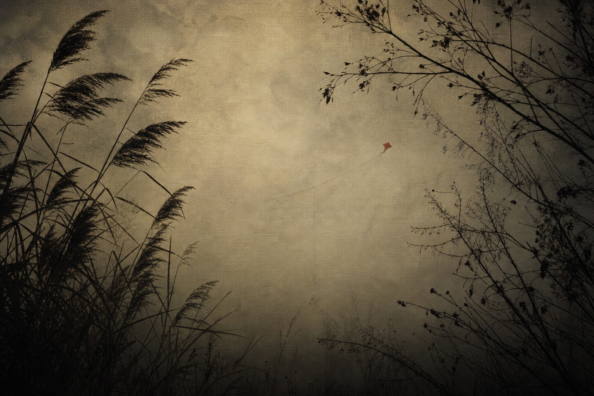
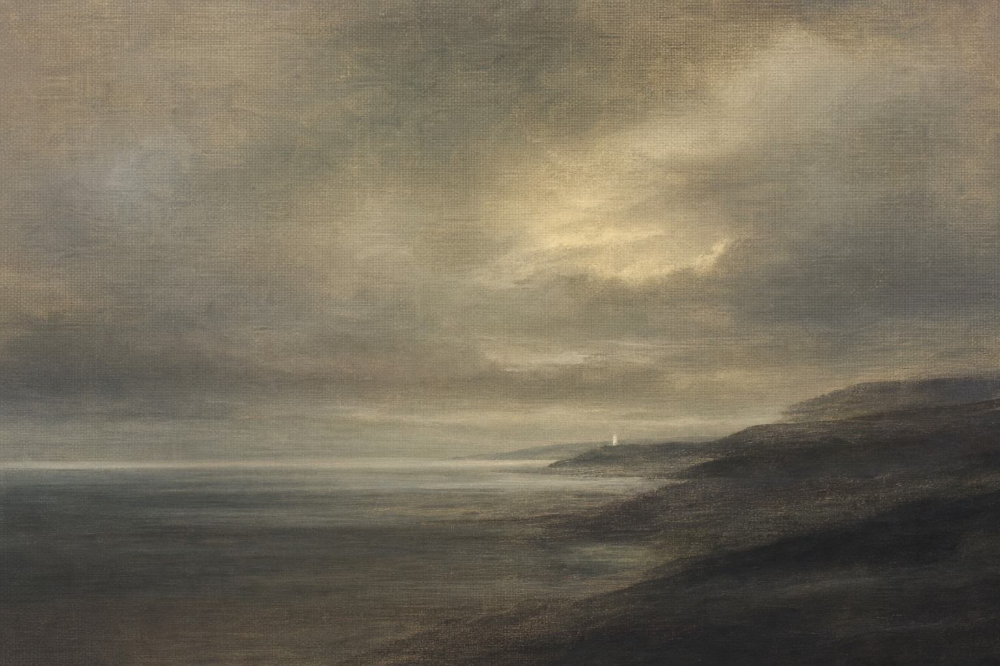

# 暗幕影像 · Dark Canvas

给图片生成 agent 的摄影风格 skill：中性烟灰、自然剪影、阴云留白、细密平面印相。支持从零生图与已有照片转换；旧 Creative OS 暖灰织物效果保留为独立变体。



上图按用户补发的清晰参考生成，是近似校准样本，尚未获得用户视觉验收，不是摄影师作品。下面两张为用户已认可的旧 Creative OS 案例，色调更暖、织纹更明显。





这是基于参考图可见特征编写的原创工作流，不是摄影师官方工具，不承诺像素一致或每次生成完全相同。

## 使用

将 `skills/dark-canvas` 文件夹复制到你的 agent 的技能目录，或从 [Releases](https://github.com/yunmin311/dark-canvas-image-skill/releases) 下载技能 ZIP 并解压其中的 `dark-canvas` 文件夹。Codex 的本机用户目录通常是 `~/.codex/skills/`；在 WSL 中它是该 Linux 用户的目录，Windows 用户目录需要另行选择。支持 SKILL.md 的其他 agent 可按其安装方式使用。图像生成工具由宿主环境提供，仓库不包含 API 密钥或模型服务。

示例请求：

```text
用 $dark-canvas 生成一张灰绿阴云与岸边树影的横幅，主体很小，不要文字。
```

```text
用 $dark-canvas 把这张照片转成暖灰织物印相质感，保持人物、建筑、物件位置和原裁切。
```

查看 [skill 入口](skills/dark-canvas/SKILL.md)、[视觉配方](skills/dark-canvas/references/visual-recipe.md)、[提示词模板](skills/dark-canvas/references/prompts.md) 和 [实测记录](examples/validation.md)。下载项目后可直接用浏览器打开 `preview.html` 看原图/转换切换对照。复制技能文件夹后，技能核心及风格参考图可独立使用。

## 来源与图片

风格分析以用户补发的六张清晰参考、此前六格截图，以及其已认可的两张 Creative OS AI 生成图片为基础。用户的摄影参考截图只保存在本地，未包含在公开仓库。摄影师身份的检索证据和限制见 [来源记录](SOURCES.md)。

文字与 skill 配置采用 MIT 许可证；仓库 AI 生成示例的来源单独列于 [图片说明](ASSETS.md)，不把第三方摄影作品纳入许可证。
