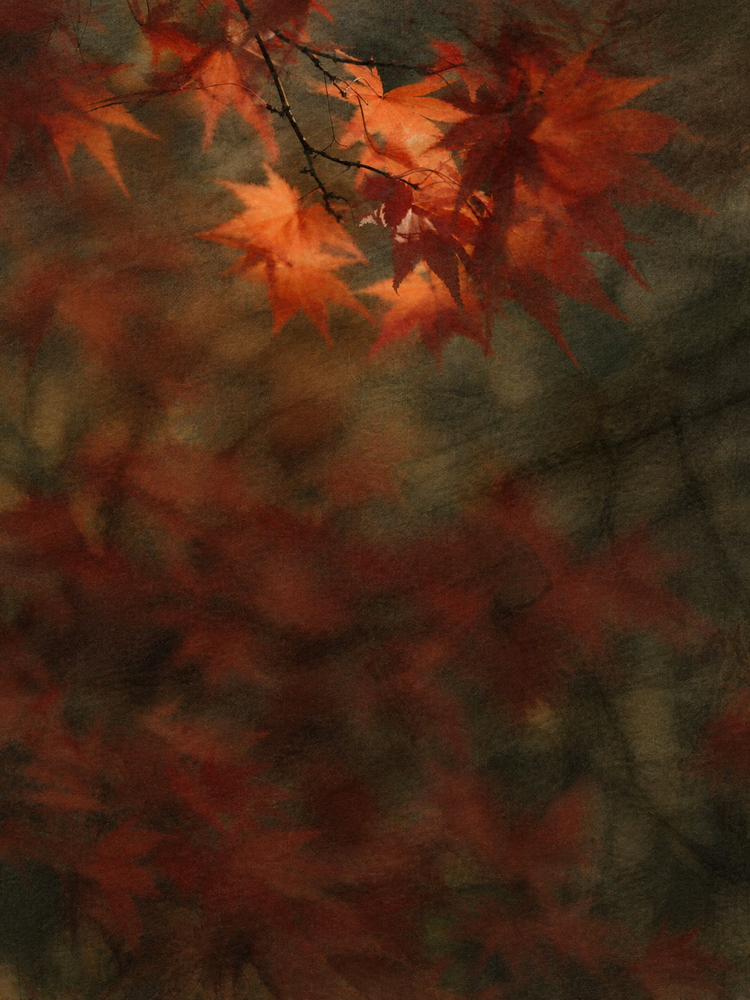
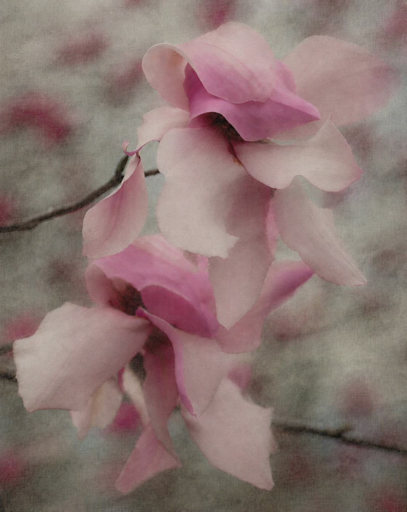

# Dark Canvas · 暗幕影像

**Reference-guided image-to-image rendering with poetic forms and a woven-canvas surface.**

**以实际视觉参考为依据，将照片转成具有诗意色形与经纬画布质感的影像。**

[中文](#中文) · [English](#english)

## 效果预览 · Selected results

以下均为用户已认可的 AI 成图：前两张是早期 Creative OS 案例，后两张是当前技能的真实照片图生图结果。展示选定版本，保留完整画幅。

User-approved AI outputs: two earlier Creative OS examples, followed by two real-photo edits using the current skill. Full frames are shown.

| 海岸 · Coast | 植物 · Botanical |
| --- | --- |
|  |  |
| Creative OS · 已认可 AI 成图 / Approved AI example | Creative OS · 已认可 AI 成图 / Approved AI example |

| 秋叶 · Autumn leaves | 玉兰 · Magnolia |
| --- | --- |
|  |  |
| 图生图中间稿 v2 / Selected intermediate edit v2 | 图生图第二稿 v2 / Selected edit v2 |

原片摄影 / Source photography: [Annie Spratt — 秋叶 / leaves](https://unsplash.com/photos/red-maple-leaves-in-close-up-photography-fNga_VEZmC8) · [Bernd Dittrich — 玉兰 / magnolia](https://unsplash.com/photos/delicate-pink-magnolia-blossoms-on-a-branch-z5x3ss6Uw24)。[展示图来源与许可 / Provenance and licensing](docs/showcase/NOTICE.md)

## 中文

### 项目定位

Dark Canvas 是供图像生成 agent 使用的图生图技能，主要面向风光、乡间景物与自然近物。它通过细节取舍、连续色面、选择性柔化和统一布面，形成接近中国山水画气息的平静表达。

处理以原照片的光照、曝光、主要颜色、主体姿态和构图为依据。画布质感贯穿主体与背景；干净布面、轻度做旧、局部磨损以及柔化程度根据具体参考选择。暗底、低地平线和黑色剪影均不是固定要求。

本项目提供技能指令、视觉观察、编辑请求模板和验收方法。图像编辑由宿主工具执行，项目本身不包含模型服务。

### 使用方式

1. 从 [Releases](https://github.com/yunmin311/dark-canvas-image-skill/releases) 下载技能包，将其中的 `dark-canvas` 文件夹放入宿主技能目录；Codex 通常使用 `~/.codex/skills/`。也可使用仓库中的 `skills/dark-canvas/` 文件夹。
2. 向 agent 提供原照片及目标视觉参考。公开包不包含用户提供的摄影作品，可使用本次附图或包内两张已认可的 Creative OS AI 案例。
3. 调用 `$dark-canvas`，说明需要保留的主体、构图与颜色，以及希望取舍的次要细节。
4. 对照原片评估结果，再针对主要偏差修正。选定版本以实际视觉验收为准。

```text
用 $dark-canvas 处理这张照片，参考附图的薄色形与细画布关系。
保持原光照、主色和构图，保留主体姿态；合并次要细节，
让部分色形与背景相融，旧痕和柔化程度按参考选择。
```

当前发布版：[v0.7.0](https://github.com/yunmin311/dark-canvas-image-skill/releases/tag/v0.7.0)。版本变化见 [CHANGELOG](CHANGELOG.md)；安装包是对应版本的快照。

### 验证范围

真实照片的逐轮测试已有用户通过案例：夜景枝叶与灯影、竹叶近物、湖岸枯树、雾山远岸、人物与船影、云景、玉兰、彩鸟、雾山乡村、秋叶及礁岸。

通过记录对应具体输入与选定版本，不能直接推广为整类题材均可稳定复现。密集景物、复杂建筑和强细节主体仍需逐图判断；复杂公园测试尚未通过。工具执行成功、材质相似与用户认可分别记录，不承诺像素级复制或还原摄影师的制作工艺。

### 文档与资源

| 文档 | 内容 |
| --- | --- |
| [当前验收记录](skills/dark-canvas/references/validation-status.md) | 用户选定版本与未解决范围 |
| [技能入口](skills/dark-canvas/SKILL.md) | 执行流程、参考选择与适用范围 |
| [画布与光色](skills/dark-canvas/references/canvas-and-light.md) | 经纬、曝光、色彩及局部效果 |
| [作品索引](skills/dark-canvas/references/reference-map.md) | 按可见表达选择参考 |
| [逐图观察](skills/dark-canvas/references/reference-study.md) | 构图、主体、背景与表面分析 |
| [主题适配](skills/dark-canvas/references/landscape-adaptation.md) | 适配建议与历次测试记录 |
| [编辑模板](skills/dark-canvas/references/prompts.md) | 初次编辑与定向修正请求 |
| [成品验收](skills/dark-canvas/references/acceptance.md) | 光色、主体、布面与交付检查 |
| [素材说明](ASSETS.md) · [来源记录](SOURCES.md) | 图片性质、来源与归属依据 |

参考研究包含 24 张用户提供的作品观察，其中一张已排除、23 张参与目标研究。原作品、测试原片及未选入展示的测试结果仅保留本地；本页两张精选图生图结果经用户要求公开展示，不加入技能安装包。包内 Creative OS 案例为 AI 成图，素材目录中的真实亚麻与生成做旧示意分别标注来源。

### 许可与归属

原创文字与配置采用 [MIT License](LICENSE)。第三方素材适用各自许可，详见 [素材目录](skills/dark-canvas/assets/materials/NOTICE.md)。用户将摄影参考归于 Pablo Bueno；账号身份尚未独立核实，项目与摄影师无已声明的官方合作或背书关系。

## English

### Overview

Dark Canvas is an image-to-image skill for image-generation agents, focused on landscapes, rural scenes, and natural subjects. It combines selective detail reduction, continuous tonal fields, localized softening, and a shared woven surface to create a quiet, poetic image with an affinity to Chinese landscape painting.

The source photograph anchors lighting, exposure, dominant colors, subject pose, and composition. Surface wear and edge treatment follow the selected visual reference. Dark backgrounds, low horizons, and black silhouettes are optional properties rather than universal requirements.

The repository provides skill instructions, visual observations, editing templates, and evaluation criteria. Image editing is performed by the host environment; no model service is included.

### Getting started

1. Download a skill package from [Releases](https://github.com/yunmin311/dark-canvas-image-skill/releases) and place its `dark-canvas` folder in your host's skill directory. Codex commonly uses `~/.codex/skills/`. Alternatively, use the repository's `skills/dark-canvas/` folder.
2. Supply a source photograph and a visual reference. Public packages exclude user-provided photographic works; use your own reference or one of the two included, approved Creative OS AI examples.
3. Invoke `$dark-canvas`, specifying the subject, composition, colors, and details that matter.
4. Compare the result with the source and refine the most significant deviations. Select the final version through visual review.

```text
Use $dark-canvas to edit this photograph using the attached reference's
thin forms and fine woven surface. Preserve source lighting, dominant
colors, composition, and subject pose. Merge secondary detail and allow
selected forms to blend into the background. Match wear and softening
to the reference.
```

Current release: [v0.7.0](https://github.com/yunmin311/dark-canvas-image-skill/releases/tag/v0.7.0). See the [changelog](CHANGELOG.md) for changes; each package is a snapshot of its tagged version.

### Validation scope

User-approved iterations on real photographs include night scenes with foliage and lights, bamboo, bare shoreline trees, misty landscapes, people and boats, clouds, magnolia, a colorful bird, a mountain village, autumn leaves, and a rocky coast.

Approval applies to individual inputs and selected versions. It does not establish reliable reproduction across an entire subject category. Dense scenes, complex architecture, and highly detailed subjects still require individual evaluation; the complex park test remains unapproved. Tool completion, material similarity, and user approval are recorded separately. The project does not promise pixel-exact reproduction or reconstruction of a photographer's production process.

### Documentation and assets

| Document | Purpose |
| --- | --- |
| [Current validation status](skills/dark-canvas/references/validation-status.md) | Selected outputs and unresolved scope |
| [Skill entrypoint](skills/dark-canvas/SKILL.md) | Workflow, reference selection, and scope |
| [Canvas and light](skills/dark-canvas/references/canvas-and-light.md) | Weave, exposure, color, and local effects |
| [Reference index](skills/dark-canvas/references/reference-map.md) | Selecting references by visible treatment |
| [Reference study](skills/dark-canvas/references/reference-study.md) | Composition, subjects, backgrounds, and surfaces |
| [Subject adaptation](skills/dark-canvas/references/landscape-adaptation.md) | Adaptation guidance and historical test records |
| [Editing templates](skills/dark-canvas/references/prompts.md) | Initial edits and targeted corrections |
| [Acceptance criteria](skills/dark-canvas/references/acceptance.md) | Visual and delivery checks |
| [Asset notes](ASSETS.md) · [Sources](SOURCES.md) | Provenance and attribution |

The reference study covers 24 user-supplied works; one is excluded and 23 inform the target study. Original works, test photographs, and test results outside the selected showcase remain local. At the user’s request, two selected image-to-image outputs are published here as README examples, outside the installable skill package. The included Creative OS examples are AI-generated. Actual linen textures and generated wear guides have separate provenance records.

### License and attribution

Original text and configuration use the [MIT License](LICENSE). Third-party assets retain their respective licenses; see the [material notices](skills/dark-canvas/assets/materials/NOTICE.md). The user attributes the photographic references to Pablo Bueno; the account identity has not been independently verified. No official affiliation or endorsement is asserted.
