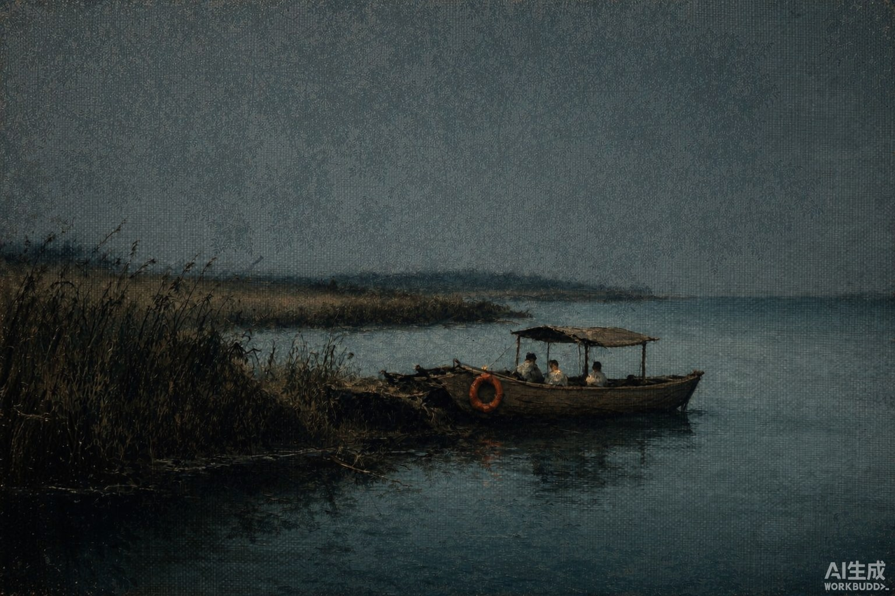
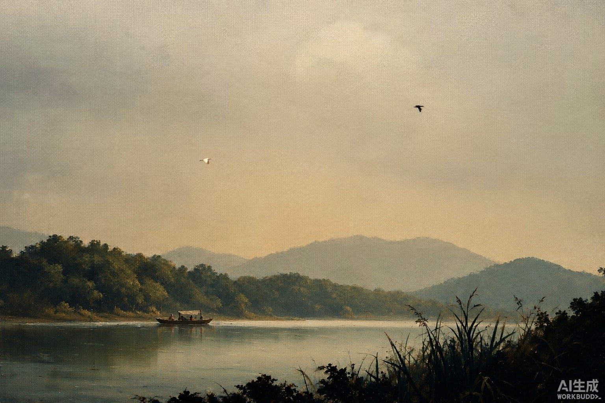
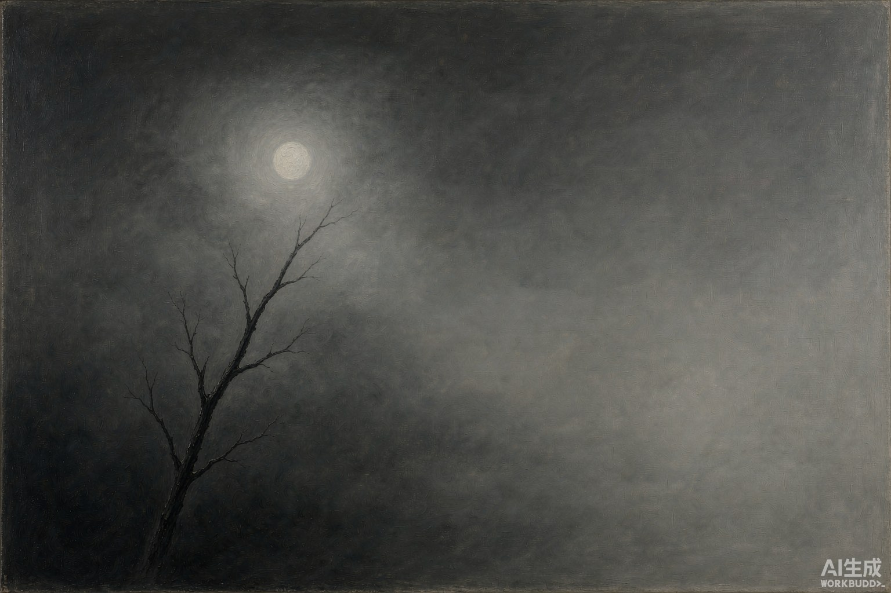

# 暗幕影像 · Dark Canvas

给图片生成 agent 的 skill，复现摄影师 **Pablo Bueno** 的安静自然油画语言。

**恒定的是表面与构图，可变的是色彩。**

- **恒定**：亚麻画布织纹、晕开色团、羽化边缘、哑光、3:2、低地平线、天空/水面约 2/3、层次退远的山、近黑剪影入画、至多一个锐利锚点
- **可变**：**色域由场景决定**——冷蓝夜渡、烟灰单色、暖金夕照、灰绿雾山各有各的调子，不存在固定色调






以上四张是按不同场景色域实测生成的样本（3:2，1536×1024），**非摄影师作品**。

> **已知工具缺陷**：`image_gen` 在所有输出右下角压「AI生成」水印，提示词与 `footnote` 参数均无法关闭（7/7 复现）。这是工具的 AI 生成内容标识，属合规标注，**予以保留不做擦除**。

这是基于参考图可见特征编写的原创工作流，不是摄影师官方工具，不承诺像素一致。

## 校准结论

对二十四张参考逐张复核，经两轮修正：

| | 最初版本 | v0.2.0 | 现在 |
| --- | --- | --- | --- |
| 默认色域 | 中性烟灰近黑白 | 暖金／赭石 | **按场景选**，无固定默认 |
| 质感 | 要求"不是油画""去掉笔触" | 亚麻布面油画 | 同左，已确立 |
| 织纹 | "放大后才可见" | 缩略图级可见 | 同左 |
| 母题 | 明令不得加入小鸟 | 鸟／飞鸟为高频母题 | 同左 |

**最大的一次错误是把可变项当成了恒定项**：色彩跟着场景走，不该套固定滤镜。

## 使用

将 `skills/dark-canvas` 文件夹复制到你的 agent 的技能目录，或从 [Releases](https://github.com/yunmin311/dark-canvas-image-skill/releases) 下载技能 ZIP 并解压其中的 `dark-canvas` 文件夹。Codex 的本机用户目录通常是 `~/.codex/skills/`；在 WSL 中是该 Linux 用户的目录。支持 SKILL.md 的其他 agent 按其安装方式使用。图像生成工具由宿主环境提供，仓库不包含 API 密钥或模型服务。

示例请求：

```text
用 $dark-canvas 画一张黄昏渔火：冷蓝暮色的小船，只有救生圈一点暖色，织纹要看得见。
```

```text
用 $dark-canvas 画一张清晨薄雾的湖，奶白暖光、灰绿远林、几条小船。
```

```text
用 $dark-canvas 把这张阴天的冷调照片重画成亚麻油画质感，保持建筑和栈桥位置，色调跟着原图走。
```

查看 [skill 入口](skills/dark-canvas/SKILL.md)、[视觉配方](skills/dark-canvas/references/visual-recipe.md)、[提示词模板](skills/dark-canvas/references/prompts.md) 和 [实测记录](examples/validation.md)。下载后可直接用浏览器打开 `preview.html` 看并排对照。

## 来源与图片

风格分析以 Pablo Bueno 的二十四张参考图与两张已认可的 Creative OS AI 生成案例为基础。**摄影参考只保存在本地被忽略的目录，不包含在公开仓库中。** 摄影师身份由用户确认；同名候选与检索限制见 [来源记录](SOURCES.md)。

文字与 skill 配置采用 MIT 许可证；仓库内 AI 生成示例的来源逐张列于 [图片说明](ASSETS.md)，不把第三方摄影作品纳入许可证。
